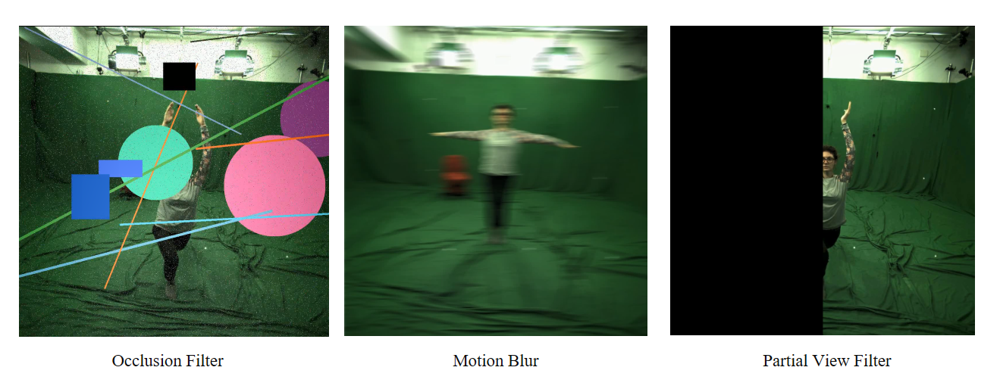
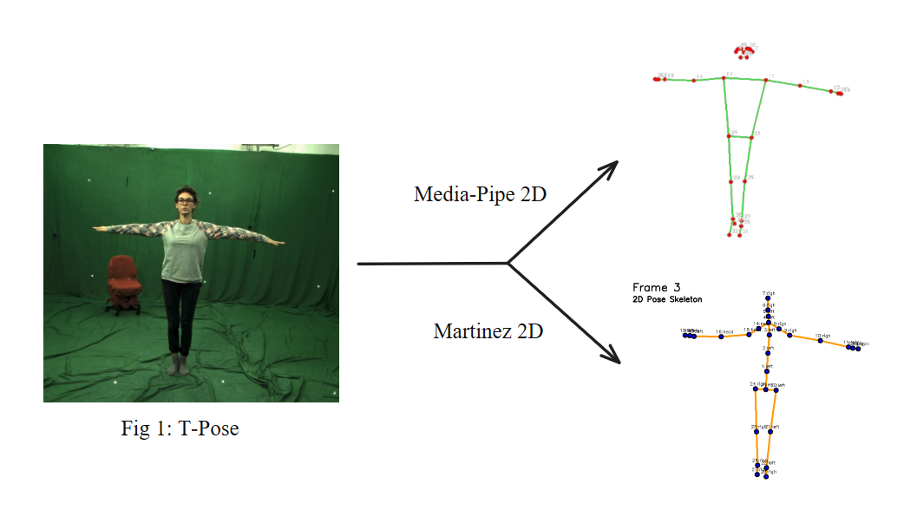
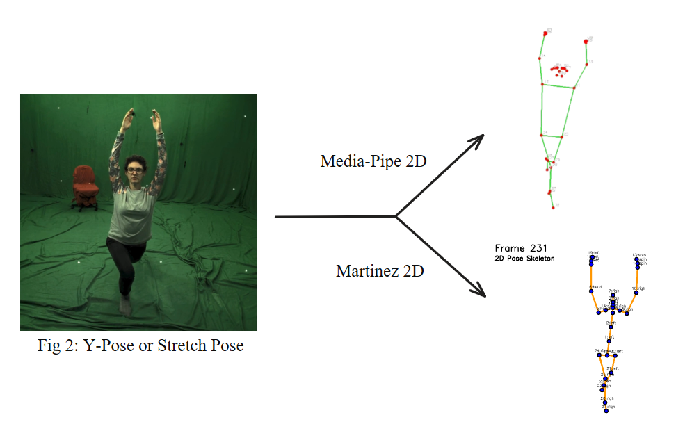
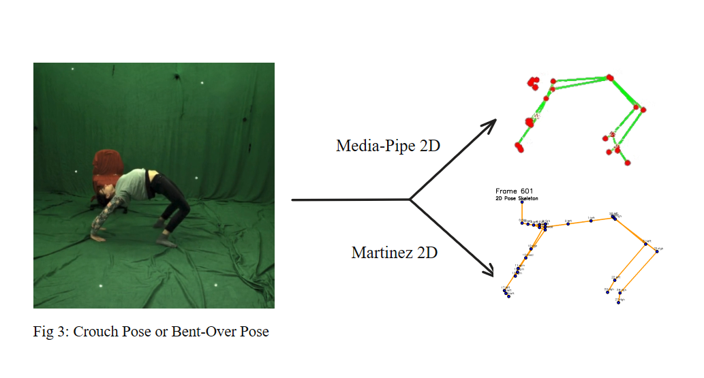

# Pose Estimation Toolkit: A Comprehensive Comparative Study

<div align="center">
  
  
  
  
  
</div>

<div align="center">
  <h3>🎯 A Rigorous Comparative Analysis of MediaPipe and Martinez Neural Network Architectures for Human Pose Estimation, Carried out at the Indian Institute of Information Technology Kottayam Using the Max Planck Dataset</h3>
</div>

---

## 📋 Table of Contents

- [Overview](#-overview)
- [Key Features](#-key-features)
- [Technology Stack](#-technology-stack)
- [Live Demos](#-live-demos)
- [Installation](#-installation)
- [Usage](#-usage)
- [Challenging Visual Conditions](#-usage)
- [Results & Screenshots](#-results--screenshots)
- [Benchmark Results](#-benchmark-results)
- [Project Structure](#-project-structure)
- [Research Applications](#-research-applications)
- [Contributing](#-contributing)
- [Contact](#-contact)

---

## 🚀 Overview

A comprehensive comparative study analyzing human pose estimation performance between Google's MediaPipe real-time detection framework and the Martinez neural network architecture. This research toolkit provides in-depth analysis, benchmarking, and evaluation of two fundamentally different approaches to 3D human pose estimation.

### 🔬 Key Research Questions

- How does MediaPipe's real-time performance compare to Martinez network's accuracy?
- What are the trade-offs between 2D pose detection and 2D-to-3D pose lifting?
- Which approach performs better under different conditions and use cases?

---

## ✨ Key Features

### 🎥 MediaPipe Integration
- ✅ **Real-time Processing**: Webcam, image, and video analysis
- ✅ **Multi-format Support**: MP4, AVI, MOV, MKV, WMV
- ✅ **Joint Tracking**: 33 body landmarks with confidence scores
- ✅ **Export Options**: JSON, CSV, and visualization outputs
- ✅ **Advanced Settings**: Configurable detection parameters

### 🧠 Martinez Neural Network
- ✅ **2D-to-3D Conversion**: Advanced pose lifting architecture
- ✅ **Deep Learning**: PyTorch implementation with custom models
- ✅ **3D Reconstruction**: Complete skeleton visualization
- ✅ **Batch Processing**: Multiple file processing capability
- ✅ **Comprehensive Analysis**: Detailed pose estimation reports

---

## 🛠️ Technology Stack

<div align="center">

| Category | Technologies |
|----------|-------------|
| **Core Frameworks** |    |
| **Computer Vision** |   |
| **Data Science** |    |
| **Visualization** |   |

</div>

---

## 🌐 Live Demos

<div align="center">

| Demo | Description | Link |
|------|-------------|------|
| **MediaPipe Pose** | Real-time 2D/3D pose detection | [🔗 Try Now](https://huggingface.co/spaces/kushh108/Pose_Mediapipe) |
| **Martinez 3D Pose** | Advanced 2D-to-3D pose lifting | [🔗 Try Now](https://huggingface.co/spaces/kushh108/Human) |

</div>

---

## 🔧 Installation

### Prerequisites
- Python 3.8+
- GPU support recommended for Martinez network
- Webcam (optional, for real-time processing)

### Quick Setup

```bash
# Clone the repository
git clone https://github.com/kushal-tiwari/pose-estimation-toolkit.git
cd pose-estimation-toolkit

# Create virtual environment
python -m venv pose_env
source pose_env/bin/activate  # On Windows: pose_env\Scripts\activate

# Install dependencies
pip install -r requirements.txt

# Download pre-trained models
python download_models.py
```

### Dependencies

```bash
# Computer vision and pose estimation
opencv-python>=4.8.0
mediapipe>=0.10.0

# Deep learning frameworks
torch>=2.0.0
torchvision>=0.15.0
tensorflow>=2.0.0

# Numerical computing and data handling
numpy>=1.24.0
pandas>=2.0.0
scipy>=1.10.0

# Visualization and web interface
matplotlib>=3.7.0
gradio>=3.40.0
tqdm>=4.65.0

# Data export
openpyxl>=3.1.0
```

---

## 🚀 Usage

### 1. Web Interface

```bash
# Launch the comparative analysis interface
python app.py
```

### 2. MediaPipe Processing

```python
from pose_estimation import MediaPipeProcessor

# Initialize processor
processor = MediaPipeProcessor()

# Process video
results = processor.process_video("input_video.mp4")

# Export results
processor.export_results(results, format="json")
```

### 3. Martinez Network Processing

```python
from pose_estimation import MartinezProcessor

# Initialize with model checkpoint
processor = MartinezProcessor(model_path="model_checkpoint.pth")

# Process 2D poses to 3D
poses_3d = processor.lift_poses_2d_to_3d(poses_2d)

# Generate visualization
processor.create_3d_animation(poses_3d, "output_3d.mp4")
```

---

## 🕺 Challenging Visual Conditions



I developed a dedicated web application designed to introduce and simulate a variety of visual challenges on datasets, such as motion blur, partial views, and occlusions. This tool allows for the controlled application of these imperfections, mimicking real-world conditions where images can be degraded or partially obstructed. By doing so, it supports rigorous testing and evaluation of computer vision models, particularly in pose estimation, ensuring their robustness and adaptability to challenging, less-than-ideal visual scenarios. This capability is vital for refining models to perform reliably in practical, unconstrained environments.

---

## 📸 Results & Screenshots



Fig. 1: MediaPipe captures the overall pose but shows asymmetry in arm alignment and inconsistent limb lengths. In
contrast, Martinez 2D maintains structural symmetry with
accurate joint placement, producing a more anatomically
consistent skeleton. This highlights Martinez’s stronger pose
prior learning and spatial consistency



Fig. 2: MediaPipe struggles with arm extension and hand
localization, leading to incomplete or skewed upper-limb
joints. Martinez 2D accurately captures the stretch pose with
consistent limb proportions and upright posture, showcasing
better generalization in elevated arm poses and non-standard
joint orientations.



Fig. 3: MediaPipe fails to preserve joint continuity in bentover posture, showing disjointed limbs and misaligned joints.
Martinez 2D maintains structural coherence and realistic
articulation, correctly representing crouched limbs and torso
bend, indicating better handling of complex, low-angle poses.

---

## 📈 Benchmark Results

### Performance Metrics

| Metric / Condition                        | MediaPipe (Visuals Applied) | Martinez 2D (Visuals Applied) |
|-------------------------------------------|-----------------------------|-------------------------------|
| MED (2D pixels)                           | 10.4 px                     | 6.8 px                        |
| PCK@0.05 (Head)                           | 78.2%                       | 85.7%                         |
| PCK@0.05 (Torso)                          | 80.4%                       | 88.1%                         |
| PCP (Limb Detection Rate)                 | 74.6%                       | 83.9%                         |
| Precision@0.05                            | 74.4%                       | 81.1%                         |
| OKS-based mAP                             | 63.0%                       | 76.5%                         |
| Occlusion Handling (↓ PCK drop)           | –12.0%                      | –6.7%                         |
| Motion Blur (↓ Precision drop)            | –15.2%                      | –8.5%                         |
| Partial View (↓ OKS drop)                 | –17.8%                      | –10.9%                        |


### Key Findings

- **MediaPipe**: ⚡ Superior real-time performance, lower computational requirements
- **Martinez**: 🎯 Higher accuracy, better for detailed analysis

**From the Table:**  
The results clearly show that the **Martinez 2D** method consistently outperforms **MediaPipe** across all evaluated metrics.

- **Localization Accuracy:**  
  Martinez achieves a significantly lower *Mean Euclidean Distance (MED)*, indicating more precise keypoint localization.

- **Structural Robustness:**  
  Higher *PCK* and *PCP* scores demonstrate that Martinez better captures and preserves human body structure.

- **Graceful Degradation:**  
  Under challenging visual degradations (e.g., occlusion, motion blur, partial views), Martinez experiences smaller performance drops, indicating stronger generalization to real-world conditions.

- **MediaPipe Limitations:**  
  MediaPipe’s reliance on clean, high-quality image features results in steep performance declines—particularly in *Precision* and *OKS-based mAP*—when subjected to visual noise or occlusions.

**Conclusion:**  
These findings suggest that deep learning-based models trained with **human kinematic priors** (such as Martinez et al.) provide superior accuracy, robustness, and resilience. This makes them more suitable for deployment in **unconstrained, real-world environments** compared to conventional lightweight real-time detectors.


### Supported Formats

| Category | Formats |
|----------|---------|
| **Input Video** | MP4, AVI, MOV, MKV, WMV |
| **Input Images** | JPG, PNG, BMP |
| **Models** | PyTorch (.pth) checkpoints |
| **Output Data** | JSON, CSV, NumPy arrays |
| **Visualizations** | MP4, PNG, 3D plots |

---

## 📁 Project Structure

```
POSE-ESTIMATION-TOOLKIT/ 🕺

├── Pose/ 📸                   # Contains sample pose images (pose_1.png, etc.)
│   ├── pose_1.png
│   ├── pose_2.png
│   └── pose_3.png
│
├── assets/ 🎨                 # For documentation visuals
│   ├── screenshots/ 🖼️         # Screenshots for README or docs
│   │   └── feature-demo.png
│   └── banners/ 🏷️            # Mockups, banner strips, design elements
│       └── text-strip-example.png
│
├── models/ 🧠                 # Model weights, checkpoints
│   └── model_checkpoint.pth
│
├── scripts/ 💻                # Core Python scripts for inference, training, utilities
│   ├── inference_model.py
│   ├── convert_mpi_inf_3dhp_to_....py
│   ├── mediapipe_gradio.py
│   ├── motionblur_gradio.py
│   ├── mpi_inf_loader.py
│   ├── occlusion_gradio.py
│   ├── partialviews_gradio.py
│   └── test_main.py
│
├── tests/ 🧪                  # Testing scripts, test assets
│   ├── test_converter.py
│   └── test_pose.mp4
│
├── docs/ 📚                   # Documentation (expanded explanations, findings)
│   └── findings.md
│
├── README.md 📄               # Main documentation with tables, screenshots, project overview
│
├── requirements.txt 📥         # Project dependencies (if applicable)
│
└── .git/ 🕸️                  # Git version tracking (if using GitHub)
```

---

## 🎯 Research Applications

### Academic Use Cases
- **Comparative Studies**: Benchmark different pose estimation methods
- **Performance Analysis**: Speed vs. accuracy trade-offs
- **Method Validation**: Rigorous testing protocols
- **Dataset Evaluation**: Cross-dataset generalization

### Practical Applications
- **Sports Analysis**: Movement technique assessment
- **Healthcare**: Rehabilitation progress monitoring
- **Fitness**: Exercise form correction
- **Motion Capture**: Animation and research data
- **Human-Computer Interaction (HCI)**: Gesture recognition and control interfaces
- **Robotics & Automation**: Robot motion guidance and human-robot collaboration
- **Augmented Reality (AR)**: Enhancing interactive AR experiences with body tracking
- **Smart Home Automation**: Gesture-based commands for controlling devices
- **Driver Monitoring Systems**: Detecting driver attention and fatigue in automotive settings

---

## 🤝 Contributing

We welcome contributions to improve this comparative study!

### How to Contribute

1. **Fork** the repository
2. **Create** feature branch (`git checkout -b feature/improvement`)
3. **Commit** changes (`git commit -am 'Add new feature'`)
4. **Push** to branch (`git push origin feature/improvement`)
5. **Create** Pull Request

### Areas for Contribution

- 🔧 Additional pose estimation models
- 📊 New evaluation metrics
- ⚡ Performance optimizations
- 📖 Documentation improvements
- 🧪 Test coverage expansion


---

## 🙏 Acknowledgments

- 🌀 **MediaPipe Team** – For the excellent real-time pose estimation framework.  
- 📐 **Martinez et al.** – For the seminal 2D-to-3D pose lifting architecture.  
- 💻 **Open Source Contributors** – For ongoing improvements and feedback.  
- 👩‍🏫 **Ms. Anu Maria Sebastian** (Assistant Professor, IIIT Kottayam, Dept. of CSE) – For invaluable guidance, mentorship, and support throughout the research.  
- 🎓 **IIT Madras Data Science Faculty** – For providing a strong academic foundation and fostering a research-oriented environment.  
- 🏛 **Max Planck Institute for Informatics** – For the MPI-INF-3DHP dataset essential to experimental evaluation.    
- 🙌 **Family** and ❤️ **Friends** – For unwavering support and encouragement throughout the project.  

---

## 📞 Contact

<div align="center">

| Contact Method | Link |
|----------------|------|
| 📧 **Email** | [kushal-tiwari@outlook.com](mailto:kushal-tiwari@outlook.com) |
| 🐛 **Issues** | [GitHub Issues](https://github.com/kushal-tiwari/pose-estimation-toolkit/issues) |
| 📚 **Research Paper** | Coming Soon |
| 💼 **LinkedIn** | [Connect with me](https://www.linkedin.com/in/kushal-tiwari108) |

</div>

---

<div align="center">
  <strong>⭐ If this project helped your research, please consider giving it a star! ⭐</strong>
</div>